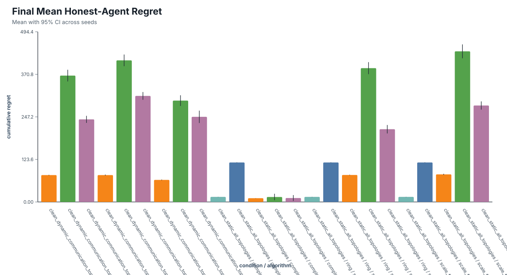
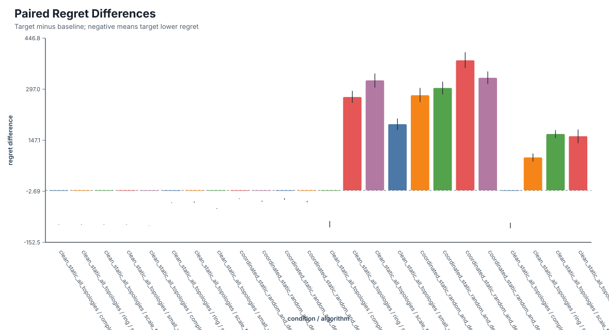
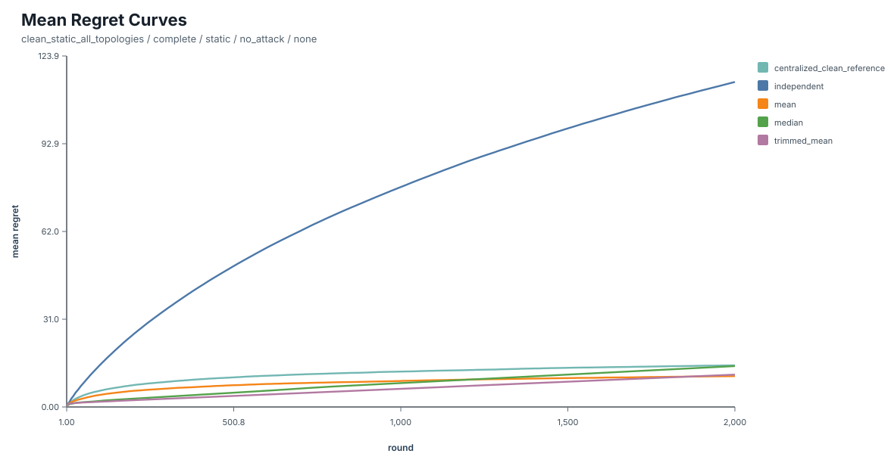
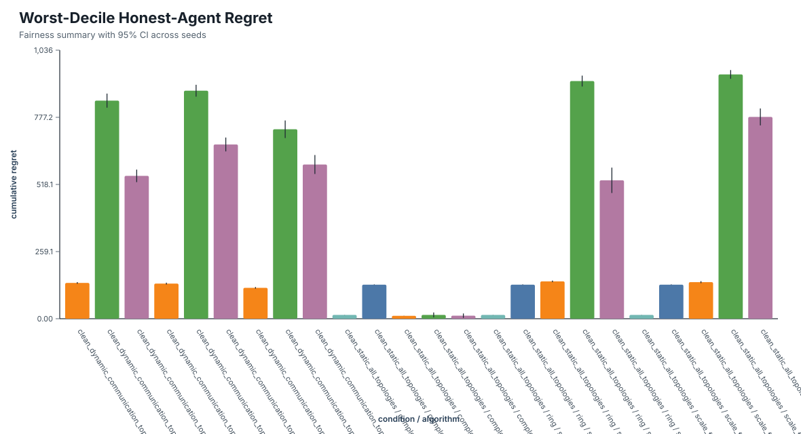
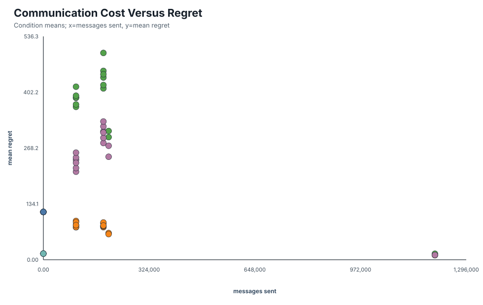

# SwarmGov-R: Robust Collective Learning under Misinformation

Status: Milestone 9 draft, 2026-08-29.

This report is a draft research write-up for the completed Milestone 8 primary
confirmatory grid. It should be read together with
`docs/confirmatory-results.md`, `docs/limitations.md`, and the reproducible
artifacts under `results/processed/confirmatory-m8/` and
`results/figures/confirmatory-m8/`.

## Abstract

SwarmGov-R studies when decentralized learning agents should share information
and when unreliable communication makes collaboration harmful. The project
implements a reproducible simulator for stochastic Bernoulli multi-armed
bandits on communication graphs with independent UCB1, a clean centralized
pooled shared-action reference, one-hop mean pooling, one-hop median
aggregation, and one-hop trimmed-mean aggregation. Byzantine agents are modeled
through controlled value corruption: they may falsify outgoing reward sums, but
reported counts, graph structure, environment rewards, and honest-agent state
remain unchanged. The completed primary confirmatory grid contains 5700 runs,
100 matched seeds per primary condition, four static graph families, one
controlled dynamic rewiring process, random and degree-centrality attacker
placement, and a coordinated-target attack at Byzantine fraction 0.2. In this
grid, one-hop count-weighted mean pooling has the lowest final mean
honest-agent regret point estimate among deployable methods in all 15 primary
condition slices. Median and trimmed-mean aggregation do not provide a
successful defense against the coordinated-target attack here. The main result
is therefore a bounded negative finding: simple one-hop robust aggregators are
not sufficient for Byzantine robustness under the implemented information
model.

## 1. Introduction

Sequential decision-making systems often learn from incomplete feedback. In a
multi-armed bandit problem, an agent repeatedly chooses one arm from a finite
set, observes only the reward for the chosen arm, and must trade off
exploration against exploitation. The classical stochastic bandit setting gives
a compact model of this tension and motivates UCB-style algorithms with
logarithmic regret guarantees under bounded rewards
[@LaiRobbins1985; @AuerCesaBianchiFischer2002; @BubeckCesaBianchi2012].

Many real decision systems are not isolated. Multiple learners may operate in
parallel, communicate over a graph, and use neighbor observations to reduce
uncertainty. Prior decentralized bandit work shows that communication can
improve learning speed, but the achievable benefit depends strongly on the
network model, communication schedule, and information available to agents
[@SzorenyiEtAl2013; @LandgrenSrivastavaLeonard2021; @MartinezRubioKanadeRebeschini2019].
This raises a practical question: if agents can improve by sharing statistics,
what happens when some shared statistics are unreliable?

SwarmGov-R addresses this question as an empirical stress test rather than a
new regret proof. The simulator evaluates decentralized cooperative UCB-style
agents over static and dynamic communication graphs, with Byzantine agents that
can corrupt outgoing reward information. The central research question is:

> Under which combinations of communication topology, Byzantine fraction, and
> graph change does robust decentralized aggregation outperform both ordinary
> one-hop weighted pooling and independent learning?

The completed primary experiments answer this question in a deliberately
bounded setting. Clean one-hop mean communication improves average regret
relative to independent UCB in static complete, ring, small-world, and
scale-free graphs. However, the implemented one-hop median and trimmed-mean
UCB baselines do not outperform one-hop mean pooling under the coordinated
Byzantine attack. Degree-centrality attacker placement is consistently more
damaging than random placement for mean pooling, while dynamic topology has
mixed rather than uniformly negative effects.

The contribution is a tested, reproducible benchmark and an evidence-bounded
negative finding. The project does not claim that median or trimmed mean are
impossible to use robustly in decentralized bandits. It shows that the simple
one-hop variants implemented here are not sufficient defenses under the tested
threat model.

## 2. Related Work

The single-agent foundation is the stochastic multi-armed bandit model. Lai and
Robbins established asymptotic lower-bound foundations for adaptive allocation
rules [@LaiRobbins1985]. Auer, Cesa-Bianchi, and Fischer introduced finite-time
UCB policies for bounded rewards, including the UCB1 baseline used in this
project [@AuerCesaBianchiFischer2002]. Bubeck and Cesa-Bianchi provide broader
regret-analysis background across stochastic and nonstochastic bandit models
[@BubeckCesaBianchi2012].

Decentralized and cooperative bandit work studies how multiple agents can share
information across a network. Szorenyi et al. study gossip-based stochastic
bandits in peer-to-peer networks and show that limited randomized
communication can accelerate learning under their assumptions
[@SzorenyiEtAl2013]. Kolla, Jagannathan, and Gopalan analyze collaborative
stochastic bandits over social networks and emphasize that topology-aware
policies can matter [@KollaJagannathanGopalan2016]. Landgren, Srivastava, and
Leonard develop cooperative UCB algorithms using running consensus, and study
how graph structure affects group performance
[@LandgrenSrivastavaLeonard2021]. Martinez-Rubio, Kanade, and Rebeschini give a
decentralized cooperative stochastic bandit algorithm with regret depending on
the spectral gap of the communication matrix
[@MartinezRubioKanadeRebeschini2019]. These works motivate SwarmGov-R's graph
stress tests, but they do not directly evaluate the controlled Byzantine
message-corruption benchmark used here.

Robust decentralized bandit work is closer to the present problem. Zhu et al.
study Byzantine-resilient decentralized multi-armed bandits and use robustness
conditions tied to the number of Byzantine neighbors
[@ZhuKoppelVelasquezLiu2024]. Hu, Wang, and Chen study robust decentralized
multi-armed bandits from corruption-resilience to Byzantine-resilience
[@HuWangChen2026]. SwarmGov-R is not presented as a replacement for these
algorithms. Instead, it implements simpler one-hop median and trimmed-mean
baselines to test whether naive robust aggregation is already enough in a
controlled simulator. The answer in the primary grid is no.

The robust-aggregation motivation also draws from Byzantine distributed
learning. Coordinate-wise median and trimmed mean have formal roles in robust
distributed statistical learning [@YinChenRamchandranBartlett2018], while
Byzantine-gradient work shows why ordinary averaging can be fragile and why
convergence or apparent stability alone may not guarantee robust behavior
[@BlanchardEtAl2017; @MhamdiGuerraouiRouault2018]. These references are not
bandit-equivalent, but they motivate the empirical question of when simple
robust statistics help or fail after being inserted into a decentralized
bandit loop.

Finally, the graph families come from standard network models: small-world
graphs [@WattsStrogatz1998] and preferential-attachment scale-free graphs
[@BarabasiAlbert1999]. Dynamic or time-varying communication appears in recent
decentralized bandit work, including random time-dependent graph settings
[@XuKlabjan2023]. SwarmGov-R's dynamic topology experiment is a controlled
single rewiring event, not a full model of mobile or asynchronous networks.

## 3. Problem Formulation

The environment is a stationary Bernoulli `K`-armed bandit. Arm `a` has an
unknown mean reward `mu[a]` in `(0, 1)`. At each round, every honest agent
selects one arm, receives an independent Bernoulli reward from the selected
arm, updates local sufficient statistics, and optionally communicates local
statistics to graph neighbors. Agents never access the true arm means.

The communication graph is undirected. Nodes are agents and edges are allowed
message channels. The static graph families are complete, ring, Watts-Strogatz
small-world, and Barabasi-Albert scale-free. Dynamic runs use one controlled
edge-rewiring event at a preconfigured change round while preserving the node
set and, for the primary grid, preserving connectivity.

Messages are typed sufficient-statistics records. The authoritative clean
message fields are per-arm `counts` and `reward_sums`; empirical means are
derived from `reward_sums / counts`. This avoids trusting two inconsistent
representations of the same observation history.

The Byzantine threat model is controlled value corruption. Byzantine senders
may falsify outgoing reward sums in their messages. They may not falsify
reported counts in the core experiment, invent support for arms they have not
observed, change environment rewards, mutate honest-agent state, modify graph
structure, read private RNG state, or alter stored ground-truth observations.
The primary attack is oblivious and coordinated: all Byzantine nodes promote
the same configured suboptimal target arm.

Communication is synchronous, instantaneous, lossless, and every-round for
communication algorithms. There are no arm collisions: multiple agents may
select the same arm in the same round and receive independent rewards. These
assumptions make the benchmark hand-checkable, but they limit transfer to
real-world systems with delays, congestion, asynchronous clocks, or strategic
resource conflicts.

## 4. Algorithms

Independent UCB1 is the no-communication baseline. Each agent maintains only
its own local counts and reward sums. Each arm is selected at least once before
ordinary scoring. After initialization, the UCB score is:

```text
score[a] = empirical_mean[a] + exploration_c * sqrt(log(t) / count[a])
```

Tie-breaking is deterministic under the injected agent RNG.

The centralized clean reference is a pooled shared-action UCB1 learner. It
chooses one shared arm for all honest agents in a round and pools all honest
rewards from that shared action. It is not an omniscient oracle and is not a
decentralized deployable algorithm. Since decentralized agents act in parallel,
this reference should not be interpreted as a guaranteed lower bound on regret.

One-hop weighted mean pooling is the ordinary collaborative baseline. Each
agent combines its own local sufficient statistics with one local-statistics
message from each current neighbor. Counts and reward sums are pooled by arm,
and UCB uses the resulting pooled estimates. This is not iterative consensus:
aggregate statistics are not recursively diffused across multiple hops, which
prevents cumulative neighbor snapshots from being double-counted.

One-hop median aggregation receives one empirical estimate per valid source and
arm, including the local source. It uses the median estimate for the arm and a
source-count effective support for the UCB exploration term. When too few valid
sources exist, the configured small-neighborhood fallback is used.

One-hop trimmed-mean aggregation similarly receives one estimate per valid
source and arm. It sorts valid source estimates, trims the configured number of
values from each tail when this will not remove all valid observations, and
uses the mean of the remainder. The confirmatory grid uses `trim_count=1` with
`median_fallback`.

## 5. Experimental Protocol

The completed primary confirmatory grid follows the frozen plan in
`docs/experiment-plan.md`. It contains 5700 completed runs and zero failed
runs, validated by `results/processed/confirmatory-m8/validation_report.json`.
Each primary condition uses 100 matched seeds from `1000..1099`.

The confirmatory environment uses 25 agents, 5 arms, horizon 2000, Bernoulli
means `[0.75, 0.65, 0.60, 0.35, 0.25]`, exploration constant
`1.41421356237`, and every-round communication for one-hop methods. Dynamic
runs rewire 20 percent of edges at round 1000. Attacked primary runs use
Byzantine fraction 0.2, target arm 3, inflated mean 1.0, and random or
degree-centrality attacker placement.

The primary run groups are:

- clean static all-topology reference;
- clean dynamic communication-topology comparison;
- coordinated static attack comparison on ring and scale-free graphs;
- coordinated dynamic attack comparison on ring and scale-free graphs.

The manifest also contains a static constant-inflation sensitivity group, but
that group has not been executed. The hard-gap reward setting and additional
Byzantine fractions are also outside the completed evidence base.

Primary metrics are final mean per-honest-agent cumulative regret, regret
curves, total honest-population regret, best-arm identification rate, median
and worst-decile honest-agent regret, recovery time for dynamic runs, messages
sent, and scalar values transmitted. Byzantine nodes are excluded from
honest-agent regret and identification metrics.

Condition and curve confidence intervals use normal approximations across
seeds. Paired algorithm differences use deterministic paired percentile
bootstrap intervals with 2000 bootstrap iterations and bootstrap seed
`20260827`. Rounds within one run are not treated as independent experimental
replicates.

## 6. Results

### 6.1 Clean Communication Helps Mean Pooling

In clean static runs, one-hop mean pooling reduces final mean honest-agent
regret relative to independent UCB in every tested topology. The paired
mean-minus-independent differences are:

| Topology | Difference | 95% CI |
| --- | ---: | ---: |
| complete | -103.85 | [-104.38, -103.32] |
| ring | -36.31 | [-37.14, -35.51] |
| small-world | -53.22 | [-54.11, -52.26] |
| scale-free | -34.59 | [-36.24, -33.00] |

This supports the clean-collaboration hypothesis for one-hop mean pooling.
It does not support a broader claim that all communication rules improve
learning, because median and trimmed mean perform poorly in several sparse
topologies.



### 6.2 Mean Pooling Is the Primary-Grid Winner by Mean Regret

Among deployable methods, one-hop count-weighted mean pooling has the lowest
final mean honest-agent regret point estimate in all 15 primary condition
slices. In the clean static grid, the final mean regret table is:

| Topology | independent | mean | median | trimmed_mean |
| --- | ---: | ---: | ---: | ---: |
| complete | 114.73 [114.22, 115.24] | 10.88 [10.60, 11.15] | 14.43 [5.02, 23.85] | 11.42 [2.86, 19.98] |
| ring | 114.73 [114.22, 115.24] | 78.42 [77.75, 79.10] | 388.80 [371.36, 406.24] | 211.38 [199.10, 223.67] |
| small-world | 114.73 [114.22, 115.24] | 61.51 [60.71, 62.31] | 309.13 [291.92, 326.33] | 273.71 [253.45, 293.96] |
| scale-free | 114.73 [114.22, 115.24] | 80.14 [78.56, 81.73] | 437.66 [417.53, 457.78] | 280.28 [268.35, 292.21] |

The centralized clean reference has final mean regret 14.70
`[14.38, 15.02]` in clean static runs. This is a clean pooled shared-action
reference, not a deployable decentralized method and not an omniscient oracle.

### 6.3 Simple Robust Aggregation Does Not Protect Here

Under coordinated-target attack, one-hop median and trimmed-mean aggregation
have substantially higher final mean regret than one-hop mean pooling in every
attacked primary condition. Positive values below mean the robust method has
higher regret than mean pooling.

| Mode | Topology | Placement | median - mean | trimmed_mean - mean |
| --- | --- | --- | ---: | ---: |
| static | ring | random | 332.49 [312.96, 351.72] | 149.74 [135.43, 164.21] |
| static | ring | degree | 303.75 [282.78, 324.67] | 130.13 [116.58, 143.46] |
| static | scale-free | random | 363.25 [344.24, 382.07] | 223.42 [209.65, 237.50] |
| static | scale-free | degree | 407.11 [385.37, 430.19] | 203.21 [188.08, 218.85] |
| dynamic | ring | random | 306.60 [288.61, 323.69] | 174.06 [162.69, 185.83] |
| dynamic | ring | degree | 279.64 [259.50, 299.36] | 152.24 [140.09, 164.77] |
| dynamic | scale-free | random | 338.66 [322.70, 355.37] | 251.05 [239.76, 262.64] |
| dynamic | scale-free | degree | 366.01 [346.32, 385.51] | 232.64 [221.34, 244.11] |

This does not support the original robustness-efficiency hypothesis for the
implemented one-hop median and trimmed-mean UCB variants. A plausible
mechanistic explanation is that these aggregators reduce exploitable extreme
values but also reduce effective statistical support in sparse neighborhoods;
that explanation should be treated as interpretation, not a proven theorem.



### 6.4 Byzantine Attacks Damage Mean Pooling, Especially at Central Nodes

The coordinated attack increases final mean regret for one-hop mean pooling in
static attacked conditions. Compared to matched clean static runs, the attack
damage is:

| Topology | Placement | Attack - clean | 95% CI |
| --- | --- | ---: | ---: |
| ring | random | 4.59 | [3.50, 5.69] |
| ring | degree | 11.74 | [11.01, 12.43] |
| scale-free | random | 1.96 | [0.62, 3.34] |
| scale-free | degree | 9.35 | [7.90, 10.75] |

The attack is therefore measurable, and high-degree placement is more damaging
than random placement for mean pooling. Under coordinated attack, the
degree-minus-random placement effects for mean pooling are:

| Mode | Topology | Degree - random | 95% CI |
| --- | --- | ---: | ---: |
| static | ring | 7.15 | [5.75, 8.47] |
| static | scale-free | 7.39 | [5.42, 9.35] |
| dynamic | ring | 10.11 | [8.57, 11.72] |
| dynamic | scale-free | 6.61 | [4.80, 8.41] |

However, in the primary static attacked grid, the attack does not make mean
pooling worse than independent UCB on average. This is a partial support result
for ordinary averaging fragility, not a catastrophic-failure result.

### 6.5 Dynamic Topology Has Mixed Effects

For one-hop mean pooling, dynamic topology does not uniformly increase regret.
Dynamic-minus-static differences are:

| Condition | Topology | Placement | Dynamic - static | 95% CI |
| --- | --- | --- | ---: | ---: |
| clean | ring | none | -0.38 | [-1.01, 0.27] |
| clean | small-world | none | 2.60 | [1.90, 3.25] |
| clean | scale-free | none | -2.04 | [-2.83, -1.21] |
| attacked | ring | random | 0.08 | [-0.73, 0.86] |
| attacked | ring | degree | 3.05 | [1.96, 4.19] |
| attacked | scale-free | random | -1.19 | [-2.24, -0.21] |
| attacked | scale-free | degree | -1.97 | [-3.07, -0.89] |

The topology-change hypothesis is therefore mixed. A single edge-rewiring event
changes outcomes, but the direction depends on graph family and attacker
placement.



### 6.6 Average Regret Hides Fairness Risk

Worst-decile honest-agent regret shows that improvements in average regret can
coexist with poor outcomes for the worst-positioned honest agents. In clean
static ring and scale-free graphs, mean pooling improves average regret
relative to independent UCB but worsens worst-decile regret:

| Topology | independent | mean | median | trimmed_mean |
| --- | ---: | ---: | ---: | ---: |
| complete | 131.38 [130.55, 132.22] | 11.21 [10.93, 11.49] | 14.72 [5.30, 24.13] | 11.69 [3.13, 20.25] |
| ring | 131.38 [130.55, 132.22] | 144.11 [140.99, 147.24] | 917.08 [896.07, 938.09] | 534.09 [485.13, 583.05] |
| small-world | 131.38 [130.55, 132.22] | 118.88 [115.49, 122.27] | 831.66 [794.46, 868.87] | 767.84 [720.29, 815.39] |
| scale-free | 131.38 [130.55, 132.22] | 141.10 [137.18, 145.01] | 942.65 [925.84, 959.46] | 778.67 [745.98, 811.37] |

This matters because decentralized systems are often evaluated by population
averages. In this benchmark, the population average alone would miss a genuine
distributional risk.



### 6.7 Communication Cost

Independent UCB sends no messages. One-hop methods send one directed message in
each direction along each active edge at each communication round, with two
per-arm vectors per message: counts and reward sums. In clean static runs with
25 agents, 5 arms, and 2000 rounds, complete graphs require 1,200,000 messages
and 12,000,000 scalar values; ring graphs require 100,000 messages and
1,000,000 scalar values; small-world graphs require 200,000 messages and
2,000,000 scalar values; scale-free graphs require 184,000 messages and
1,840,000 scalar values.

The communication-regret tradeoff is not summarized by a single winner. Mean
pooling obtains the best regret among deployable methods in the primary grid,
but it does so by using every-round communication. Future work should test
lower-frequency communication and budgeted messaging.



## 7. Discussion

The clean setting supports the standard intuition that sharing information can
reduce regret. The magnitude is largest in the complete graph, where mean
pooling reduces final mean regret by 103.85 compared with independent UCB, but
mean pooling also helps in ring, small-world, and scale-free graphs.

The attacked setting complicates the robustness story. The primary attack is
not harmless: it increases mean-pooling regret, and the damage is larger when
Byzantine agents occupy high-degree nodes. This supports the view that topology
and placement matter, not just the number of attackers. But mean pooling still
beats independent UCB on mean regret in the attacked primary conditions. The
more surprising result is that median and trimmed mean do not help here. They
are robust statistics in many estimation settings, but the way they are
embedded into one-hop UCB creates a cost in statistical support and learning
speed that dominates in this grid.

This result should be framed as a negative empirical finding. It does not
invalidate robust aggregation as a research direction. Rather, it shows that
one cannot assume that a robust statistic remains effective after being placed
inside a local, repeated, graph-mediated bandit algorithm. Robustness depends
on message semantics, support accounting, neighborhood size, attacker
placement, and exploration dynamics.

The dynamic topology result is also informative because it rejects a simple
story. A graph change is not automatically harmful in this benchmark. Depending
on the initial graph and attack placement, rewiring can slightly harm, help, or
have no clear effect on mean pooling. This points toward more careful dynamic
experiments in which edge churn, connectivity, and attacker exposure are
measured directly.

## 8. Limitations and Threats to Validity

The completed evidence covers only the primary confirmatory grid. The
constant-inflation sensitivity group in the manifest has not been executed, and
the hard-gap reward setting planned earlier is not part of the completed
results. The horizon is 2000 rounds rather than the initial canonical 10000
rounds. This was frozen before confirmatory execution, but it limits long-run
claims.

The threat model is intentionally controlled. Byzantine agents corrupt outgoing
reward sums while counts remain truthful. They cannot invent support, adapt to
private RNG state, change rewards, or manipulate the topology. This makes the
benchmark easier to validate, but weaker than a fully arbitrary Byzantine
message model.

The communication model is synchronous, instantaneous, lossless, and
every-round. There are no message delays, dropped packets, queueing effects,
asynchronous clocks, or communication failures. There are also no arm
collisions. Multiple agents can choose the same arm at the same time and
receive independent rewards.

The robust algorithms are simple one-hop baselines. They do not implement the
more sophisticated resilient decentralized bandit methods proposed in recent
work, and they do not provide theoretical Byzantine-safety guarantees.

The statistical summaries use 100 seeds per primary condition. This is enough
to report uncertainty for the frozen grid, but it does not eliminate sensitivity
to reward gaps, horizons, graph parameters, trim parameters, Byzantine
fractions, or attack families. No multiple-comparison correction is applied
across all reported slices.

## 9. Reproducibility

The primary artifacts are:

- manifest: `experiments/manifests/confirmatory_m8_manifest.json`;
- raw records: `results/raw/confirmatory-m8/`;
- validation report: `results/processed/confirmatory-m8/validation_report.json`;
- processed tables: `results/processed/confirmatory-m8/`;
- figures: `results/figures/confirmatory-m8/`;
- result interpretation: `docs/confirmatory-results.md`.

The validated primary run count is 5700 completed runs and zero failed runs.
The full primary pipeline can be regenerated with:

```bash
python3 experiments/scripts/run_milestone8_pipeline.py \
  --manifest experiments/manifests/confirmatory_m8_manifest.json \
  --raw-dir results/raw/confirmatory-m8 \
  --processed-dir results/processed/confirmatory-m8 \
  --figures-dir results/figures/confirmatory-m8 \
  --workers 12 \
  --overwrite-derived
```

For a sub-minute technical check, use:

```bash
python3 -m swarmgov run --config configs/smoke.yaml
```

The codebase uses deterministic seed derivation through NumPy
`SeedSequence`, typed configuration files, non-interactive runners, validation
before aggregation, and tests for core simulation invariants.

## 10. Conclusion

SwarmGov-R's completed primary experiments show that, in the tested clean
settings, one-hop mean communication can substantially reduce average regret
relative to independent UCB. Under the controlled Byzantine value-corruption
model, mean pooling degrades, with larger effects when Byzantine agents occupy
high-degree nodes. However, the one-hop median and trimmed-mean variants
implemented in this benchmark do not provide an effective defense under the
tested coordinated attacks: they do not consistently recover clean-setting
performance and can perform poorly even without attackers in sparse
topologies. Dynamic topology also affects performance, but its impact is not
monotonic across the tested configurations.

The evidence therefore supports a deliberately narrow conclusion. Within this
controlled decentralized bandit benchmark, ordinary one-hop mean pooling is
surprisingly effective on average in clean conditions, naive one-hop robust
aggregation is insufficient against the tested attacks, attacker placement
materially affects outcomes, and fairness-oriented metrics reveal risks that
population averages can conceal.

These findings are empirical rather than theoretical guarantees and are
limited to the threat model, bandit instance, graph families, horizon,
Byzantine fractions, and topology changes included in the experimental design.
They do not establish that collaboration is always beneficial, that median or
trimmed-mean aggregation is generally ineffective, or that Byzantine-robust
decentralized learning has been solved.

Future work should implement and reproduce a faithful Byzantine-resilient
decentralized bandit baseline, such as Byzantine-Resilient UCB or DeMABAR, and
compare it with the current heuristics through controlled ablations. Further
evaluation should include arbitrary-message and adaptive attacks, manipulation
of reported counts, hard-gap reward settings, additional Byzantine fractions,
local Byzantine and node-degree diagnostics, communication-frequency ablations,
and richer dynamic-topology processes before broader robustness claims are
made.

## References

Bibliographic records are stored in `report/references.bib`. Citation keys in
this draft correspond to entries inspected in `docs/literature-notes.md` and
the Milestone 9 source-inspection note added there.
